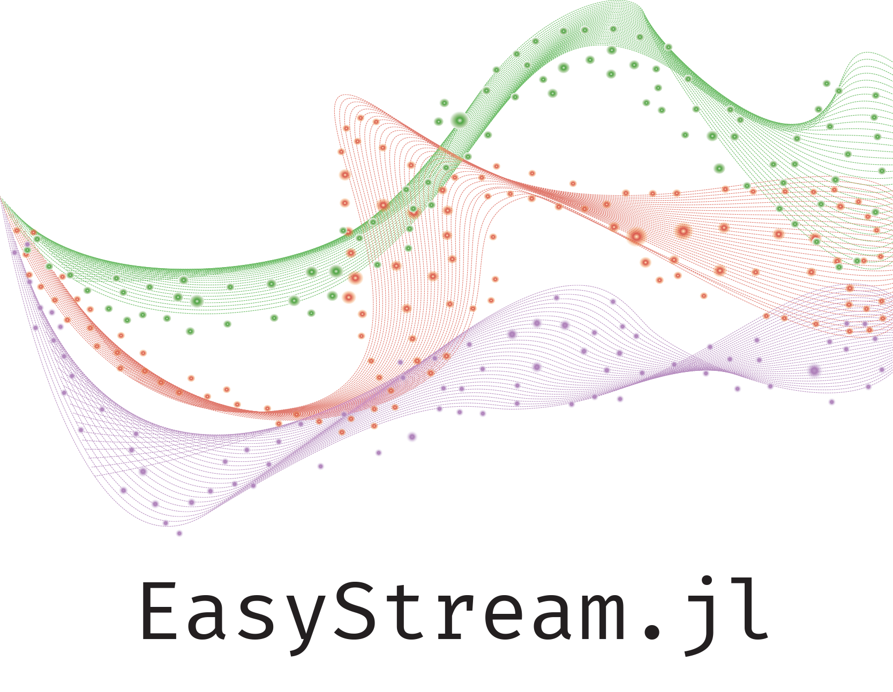

<p align="center">
  <br>
</p>
  
[![][docs-dev-img]][docs-dev-url] [![][travis-img]][travis-url] [![][codecov-img]][codecov-url] [![][coverage-img]][coverage-url] 

## About

O EasyStream.jl tem como objetivo criar uma interface simples para trabalhar com stream, atuando como exemplo em problemas relacionados como o concept drift. Nas próximas seções serão discutidos os elementos básicos do framework.

## Project goals

- A framework for data stream in a modern programming language.

## Installation

The package can be installed with the Julia package manager.
From the Julia REPL, type `]` to enter the Pkg REPL mode and run:

```
pkg> add EasyStream
```

Or, equivalently, via the `Pkg` API:

```julia
julia> import Pkg; Pkg.add("EasyStream")
```

## Documentation

- **STABLE** &mdash; **most recently tagged version of the documentation.** (under construction)
- [**LATEST**][docs-dev-url] &mdash; *in-development version of the documentation.*

## Tutorials

Under construction.

## Packages

Some important packages:
- **[StreamDatasets.jl](https://github.com/ATISLabs/StreamDatasets.jl)**: Package with synthetics datasets. (under construction)
- **[SyntheticDatasets.jl](https://github.com/ATISLabs/SyntheticDatasets.jl)**: Packages with stream datasets. 

[docs-dev-img]: https://img.shields.io/badge/docs-dev-blue.svg
[docs-dev-url]: https://atislabs.github.io/EasyStream.jl/dev/

[travis-img]: https://travis-ci.com/ATISLabs/EasyStream.jl.svg?branch=master
[travis-url]: https://travis-ci.com/ATISLabs/EasyStream.jl

[codecov-img]: https://codecov.io/gh/ATISLabs/EasyStream.jl/branch/master/graph/badge.svg?token=13TrPsgakO
[codecov-url]: https://codecov.io/gh/ATISLabs/EasyStream.jl

[coverage-img]: https://coveralls.io/repos/github/ATISLabs/EasyStream.jl/badge.svg?branch=master
[coverage-url]: https://coveralls.io/github/ATISLabs/EasyStream.jl?branch=master
